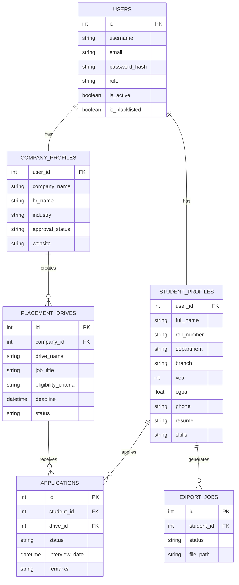

# Placement Portal Application (PPA)

A full-stack Campus Recruitment System built with **Flask** (backend) + **Vue 3** (frontend, CDN) + **SQLite** (database).

---

## Tech Stack

| Layer       | Technology                     |
|-------------|--------------------------------|
| Backend     | Python 3.11 · Flask 3.x        |
| Frontend    | Vue 3 (CDN) · Bootstrap 5      |
| Database    | SQLite (via Python `sqlite3`)  |
| Auth        | JWT (PyJWT)                    |
| Charts      | Chart.js (CDN)                 |
| PDF Reports | ReportLab                      |
| Async Jobs  | Python `threading` (Celery-ready) |
| Caching     | Redis / Flask-Caching (optional) |

---

## Quick Start

### 1. Install dependencies

```bash
pip install Flask PyJWT Werkzeug python-dotenv reportlab requests
# Optional (for Celery/Redis):
pip install celery redis flask-caching flask-cors flask-mail
```

### 2. Configure environment

Copy `.env` and edit as needed:
```bash
cp .env .env.local  # edit MAIL_USERNAME etc.
```

### 3. Run the server

```bash
python run.py
# or
python app.py
```

Open **http://localhost:5000**

---

## Default Credentials

| Role  | Username | Password  |
|-------|----------|-----------|
| Admin | `admin`  | `admin123`|

Admin is pre-seeded automatically on first run.

---

## Project Structure

```
placement_portal/
├── app.py                  # Flask app factory
├── run.py                  # Convenience runner
├── config.py               # Configuration
├── celery_worker.py        # Celery entry point
├── requirements.txt
├── .env                    # Environment variables
│
├── backend/
│   ├── models.py           # SQLite schema + helpers
│   ├── tasks.py            # Celery / background tasks
│   ├── routes/
│   │   ├── auth.py         # Login / Register / JWT
│   │   ├── admin.py        # Admin APIs
│   │   ├── company.py      # Company APIs
│   │   ├── student.py      # Student APIs
│   │   └── reports.py      # PDF report generation
│   └── utils/
│       └── pdf_report.py   # ReportLab PDF builder
│
├── frontend_embedded/
│   └── index.html          # Single-file Vue 3 SPA
│
├── instance/
│   └── placement_portal.db # SQLite database (auto-created)
│
└── uploads/                # Uploaded resumes + CSV exports
```

---

## Roles & Features

### Admin
- Dashboard with live stats + Chart.js charts
- Approve / Reject company registrations
- Approve / Reject placement drives
- Blacklist / Deactivate students or companies
- View all applications
- Monthly PDF report download (`/api/admin/report/monthly/pdf`)
- Search companies and students

### Company
- Register company profile (pending admin approval)
- Create placement drives (pending admin approval)
- View student applications per drive
- Update application status: Applied → Shortlisted → Waiting → Selected / Rejected
- Dashboard with drive and applicant stats

### Student
- Self-register with full profile
- Browse approved placement drives
- Eligibility-based filtering (CGPA, branch, year)
- Apply to drives (duplicate prevention + eligibility validation)
- Track application status
- View full placement history
- Upload resume (PDF/DOC)
- Export placement history as CSV (async background job)

---

## API Reference (38 endpoints)

### Auth
| Method | Endpoint              | Description        |
|--------|-----------------------|--------------------|
| POST   | `/api/auth/register`  | Register student/company |
| POST   | `/api/auth/login`     | Login (any role)   |
| GET    | `/api/auth/me`        | Get current user   |

### Admin
| Method | Endpoint                              |
|--------|---------------------------------------|
| GET    | `/api/admin/dashboard`                |
| GET    | `/api/admin/companies`                |
| POST   | `/api/admin/companies/:id/approve`    |
| POST   | `/api/admin/companies/:id/reject`     |
| POST   | `/api/admin/companies/:id/blacklist`  |
| GET    | `/api/admin/students`                 |
| POST   | `/api/admin/students/:id/blacklist`   |
| POST   | `/api/admin/students/:id/deactivate`  |
| GET    | `/api/admin/drives`                   |
| POST   | `/api/admin/drives/:id/approve`       |
| POST   | `/api/admin/drives/:id/reject`        |
| GET    | `/api/admin/applications`             |
| GET    | `/api/admin/stats`                    |
| GET    | `/api/admin/report/monthly`           |
| GET    | `/api/admin/report/monthly/pdf`       |

### Company
| Method | Endpoint                                  |
|--------|-------------------------------------------|
| GET/PUT| `/api/company/profile`                    |
| GET/POST| `/api/company/drives`                    |
| PUT    | `/api/company/drives/:id`                 |
| GET    | `/api/company/drives/:id/applications`    |
| PUT    | `/api/company/applications/:id`           |

### Student
| Method | Endpoint                              |
|--------|---------------------------------------|
| GET/PUT| `/api/student/profile`                |
| POST   | `/api/student/profile/resume`         |
| GET    | `/api/student/drives`                 |
| POST   | `/api/student/drives/:id/apply`       |
| GET    | `/api/student/applications`           |
| GET    | `/api/student/history`                |
| GET    | `/api/student/companies`              |
| GET    | `/api/student/companies/:id`          |
| POST   | `/api/student/export`                 |
| GET    | `/api/student/export/:id/status`      |
| GET    | `/api/student/export/:id/download`    |

---

## Background Jobs

### Option A: Python Threading (default, no Redis needed)
The CSV export runs in a background thread automatically.

### Option B: Celery + Redis (full setup)
```bash
# Start Redis
redis-server

# Start Celery worker
celery -A celery_worker.celery worker --loglevel=info

# Start Celery beat (for scheduled jobs)
celery -A celery_worker.celery beat --loglevel=info
```

Scheduled jobs:
- **Daily 8 AM** → sends deadline reminders to students
- **1st of month 6 AM** → generates monthly activity report

---

## Database Schema (ER Diagram)


---

## Folder Structure for Vue Build (optional)

If you want to build the Vue frontend separately:
```bash
cd frontend
npm install
npm run build
# dist/ folder is then served by Flask
```

The embedded `frontend_embedded/index.html` works without any build step.
